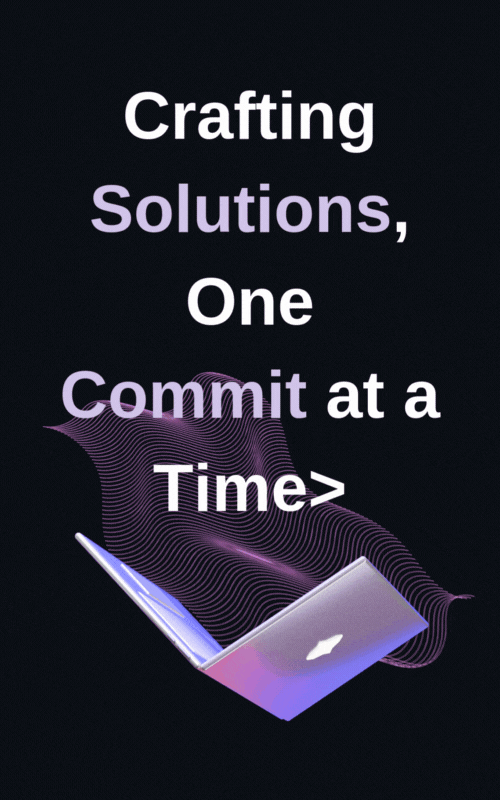

***

### About me:
- :telescope: I’m working as a Software Engineer and contributing to frontend and backend for building web applications.

- :seedling: Exploring Technical Content Writing.

- :zap: In my free time, I solve problems on GeeksforGeeks and read tech articles.

- :mailbox:How to reach me:

- :mailbox:How to reach me:

- :mailbox:How to reach me:

- :mailbox:How to reach me:

- :mailbox:How to reach me:

***

<!--  -->

<!-- GITHUB CAT MADE BY: <a href="https://iconscout.com/3d-illustrations/github-1" class="text-underline font-size-sm" target="_blank">github-1</a> by <a href="https://iconscout.com/contributors/unicons" class="text-underline font-size-sm">Unicons Font</a> on <a href="https://iconscout.com" class="text-underline font-size-sm">IconScout</a> -->
***
Credits: [3D Model of github icon](https://iconscout.com/3d-illustrations/github-1) made by [Unicons Font](https://iconscout.com/contributors/unicons)
